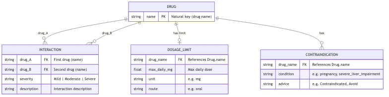

# MediSync – Offline Drug Interaction Checker

An offline, graph-based clinical decision support system that detects drug–drug interactions, contraindications, and dosage risks with explainable severity scoring.

---

## 1. Problem Statement

**Problem Title**  
Drug Interaction Detection for Resource-Constrained Healthcare

**Problem Description**  
Polypharmacy significantly increases the risk of adverse drug interactions, contraindications, and dosage conflicts. While large hospitals use integrated clinical decision systems, small clinics and rural healthcare setups lack accessible, structured, offline tools to evaluate medication conflicts quickly and safely. Manual checking through textbooks or fragmented digital sources increases prescription errors and delays treatment decisions.

**Target Users**
- Small clinic doctors
- Rural healthcare practitioners
- Pharmacists
- Medical interns
- Primary Health Centers (PHCs)

**Existing Gaps**
- No lightweight offline interaction checker
- Manual cross-referencing of drugs
- Alert fatigue in large EMR systems
- Lack of visual explanation of conflicts
- Limited accessibility in rural areas

---

## 2. Problem Understanding & Approach

**Root Cause Analysis**
- Fragmented drug interaction knowledge
- Lack of structured local database tools
- Heavy enterprise systems inaccessible to small setups
- Overreliance on manual verification

**Solution Strategy**
- Build structured drug knowledge base
- Use graph-based modeling for interactions
- Apply rule-based + AI-assisted scoring
- Ensure fully offline functionality
- Provide explainable output

---

## 3. Proposed Solution

**Solution Overview**  
MediSync is a desktop-based, offline Drug Interaction Checker that identifies medication conflicts and visualizes them using a graph model.

**Core Idea**  
Represent drugs as nodes and interactions as weighted edges. Apply severity-based logic and generate risk scores with clear explanations.

**Key Features**
- ✔ Offline-first system
- ✔ Drug–drug interaction detection
- ✔ Contraindication identification (patient context: pregnancy, liver/renal impairment, etc.)
- ✔ Dosage conflict detection (max daily dose checks)
- ✔ Severity classification (Mild / Moderate / Severe)
- ✔ Graph-based visualization
- ✔ Risk scoring engine
- ✔ Printable safety summary

---

## 4. System Architecture

**High-Level Flow**  
User → Frontend → Backend → Risk Engine → Database → Response

**Architecture Description**
- **Frontend:** User inputs medication list and views conflict graph
- **Backend:** Processes drug list and constructs interaction graph
- **Risk Engine:** Applies rule-based + scoring logic
- **Database:** Local structured drug interaction dataset
- **Response Layer:** Returns severity report + visualization data

**Architecture Diagram**  
*(Add system architecture diagram image here)*

---

## 5. Database Design

**ER Diagram**  

The ER diagram is aligned with the **current project structure** (JSON data files and backend usage). Full description, Mermaid source, and file mapping: [docs/er_diagram.md](docs/er_diagram.md).



**ER Diagram Description (project structure)**
- **Entities:**  
  - **Drug** – `name` (PK, natural key; used as key in all three data files)  
  - **Interaction** – `drug_A`, `drug_B`, `severity`, `description` (from `data/drug_interactions.json`)  
  - **DosageLimit** – `drug_name`, `max_daily_mg`, `unit`, `route` (from `data/drug_dosage_limits.json`)  
  - **Contraindication** – `drug_name`, `condition`, `advice` (from `data/drug_contraindications.json`)  
- **Relationships:**
  - Drug ↔ Interaction (Many-to-Many; one interaction links two drugs)
  - Drug → DosageLimit (One-to-One, optional)
  - Drug → Contraindication (One-to-Many)

---

## 6. Dataset Selected

**Dataset Name**  
Drug-Drug Interactions (Kaggle)

**Source**  
[mghobashy/drug-drug-interactions](https://www.kaggle.com/datasets/mghobashy/drug-drug-interactions)

**Data Type**
- Drug names (`drug_1`, `drug_2`)
- Severity (Mild / Moderate / Severe)
- Interaction description

**Selection Reason**
- Structured format
- Lightweight for offline use
- Sufficient for MVP implementation
- Open-access public resource

**Preprocessing Steps**
- Normalization of drug names
- Severity inference from description text (Mild / Moderate / Severe)
- Removal of duplicate interaction entries
- **Curated subset:** A curated subset of the Kaggle Drug-Drug Interaction dataset was structured into an optimized O(1) lookup map to enable efficient offline conflict detection. Keeps 5k–20k interactions with mixed severity and common drugs—reduces repo size, enables instant lookup, no full-table scan.

**Dataset Reproducibility (important for judging)**  
You can regenerate `data/drug_interactions.json` in one of three ways:

1. **Script (recommended)**  
   ```bash
   python scripts/load_dataset.py
   ```  
   The script will:
   - Use the **Kaggle API** if installed and configured (`pip install kaggle`, then place `kaggle.json` in `~/.kaggle/`). It downloads [mghobashy/drug-drug-interactions](https://www.kaggle.com/datasets/mghobashy/drug-drug-interactions) and converts the CSV to the JSON format below.
   - Otherwise look for **any CSV** in `data/` (e.g. `ddi_raw.csv`, `drug_interactions.csv`). Expected columns (case-insensitive): two drug columns (`drug_1`/`drug_2` or `Drug1`/`Drug2`), optional `severity`, optional `description` or `interaction`.
   - If no Kaggle and no CSV are available, use **demo mode** to build a small reproducible set:
   ```bash
   python scripts/load_dataset.py --sample
   ```
   Or point to a specific CSV: `python scripts/load_dataset.py --csv data/my_ddi.csv`.

2. **Kaggle + transformation steps**  
   - Download the dataset from [Kaggle – Drug-Drug Interactions](https://www.kaggle.com/datasets/mghobashy/drug-drug-interactions).  
   - Place the CSV in `data/`.  
   - Run `python scripts/load_dataset.py` (or `--csv data/<your_file>.csv`).  
   - Transformation: normalize drug names (title-case, trim), map severity to Mild/Moderate/Severe, build symmetric O(1) lookup map.

3. **Pre-generated JSON**  
   A pre-built `data/drug_interactions.json` may be committed to the repo; cloning then works without running the script. Running `load_dataset.py` (with Kaggle or CSV) reproduces or updates it.

**Output Format** (O(1) lookup):
```json
{
  "Aspirin": {
    "Warfarin": { "severity": "Severe", "description": "Increased bleeding risk..." }
  }
}
```

---

### Dosage limits and contraindications

- **Dosage**  
  `data/drug_dosage_limits.json` stores per-drug `max_daily_mg` (and optional `unit`, `route`).  
  In `POST /check-interactions`, send optional `drug_doses`: `[{"drug": "Ibuprofen", "daily_mg": 400}]`.  
  The response includes `dosage_warnings` when a supplied dose exceeds the stored maximum.

- **Contraindications**  
  `data/drug_contraindications.json` stores per-drug conditions (e.g. `pregnancy`, `severe_liver_impairment`, `penicillin_allergy`) and advice (e.g. "Contraindicated", "Avoid").  
  Send optional `patient_context`: `{"pregnancy": true, "severe_liver_impairment": true}`.  
  The response includes `contraindication_warnings` for each drug that has a contraindication matching the patient context.

Both data files are optional; if missing, the API still returns interaction results with empty `dosage_warnings` and `contraindication_warnings`.

---

## 7. Model Selected

**Model Name**  
Hybrid Rule-Based + Risk Scoring Engine

**Selection Reasoning**
- Medical domain requires explainability
- Deterministic decision logic preferred
- Hackathon time constraints

**Alternatives Considered**
- Full ML classification model
- Deep learning interaction prediction
- Black-box neural network system  
*Rejected due to lack of interpretability and dataset limitations.*

**Evaluation Metrics**
- Interaction detection accuracy
- Severity classification consistency
- Response time
- System reliability

---

## 8. Technology Stack

| Layer | Technology |
|-------|------------|
| **Frontend** | React, Tailwind CSS, React Flow (graph visualization) |
| **Backend** | FastAPI (Python) |
| **ML/AI** | Python, rule-based risk scoring engine |
| **Database** | JSON (offline) – `data/drug_interactions.json`, `data/drug_dosage_limits.json`, `data/drug_contraindications.json` |
| **Auth** | API key (`X-API-Key` header) |
| **Deployment** | Uvicorn, localhost:8000 |

---

## 9. API Documentation & Testing

**API Endpoints List**

| Endpoint | Method | Auth | Description |
|----------|--------|------|-------------|
| `POST /check-interactions` | POST | Required | Input: `{"drugs": ["A", "B"], "drug_doses": optional, "patient_context": optional}` → interaction report + dosage/contraindication warnings |
| `GET /drug/{name}` | GET | Required | Returns drug metadata |
| `GET /check-pair` | GET | Required | Query `drug1`, `drug2` → single pair interaction |
| `GET /health` | GET | No | System health check |

**Authentication**  
All endpoints except `/health` require `X-API-Key` header. Default demo key: `medisync-demo-key-2024`. Set `MEDISYNC_API_KEY` env var for production.

**Run API server**
```bash
pip install -r requirements.txt
python run_api.py
# Or: uvicorn api.main:app --reload --port 8000
```

**Example request (interactions only)**
```bash
curl -X POST http://localhost:8000/check-interactions \
  -H "X-API-Key: medisync-demo-key-2024" \
  -H "Content-Type: application/json" \
  -d '{"drugs": ["Ibuprofen", "Warfarin", "Digoxin"]}'
```

**Example with dosage and contraindications**
```bash
curl -X POST http://localhost:8000/check-interactions \
  -H "X-API-Key: medisync-demo-key-2024" \
  -H "Content-Type: application/json" \
  -d '{"drugs": ["Ibuprofen", "Warfarin"], "drug_doses": [{"drug": "Ibuprofen", "daily_mg": 4000}], "patient_context": {"pregnancy": true}}'
```
Response includes `dosage_warnings` (e.g. daily dose exceeds max) and `contraindication_warnings` (e.g. Warfarin in pregnancy).

**Testing**
- Unit tests: `python tests/test_interaction_checker.py` — 10 test groups
- API tests: `pytest tests/test_api.py -v` — 9 integration tests
- Example runs: `python tests/example_runs.py`

---

## 10. Module-wise Development & Deliverables

| Checkpoint | Deliverables |
|------------|--------------|
| **Checkpoint 1: Research & Planning** | Problem analysis, system design, dataset structuring |
| **Checkpoint 2: Backend Development** | Interaction detection engine, API endpoints, risk scoring logic |
| **Checkpoint 3: Frontend Development** | Drug input interface, conflict visualization, severity display |
| **Checkpoint 4: Model Training** | Risk scoring model calibration, NLP parser implementation |
| **Checkpoint 5: Model Integration** | Backend + ML integration, real-time interaction detection |
| **Checkpoint 6: Deployment** | Local deployment, demo-ready system |

---

## 11. End-to-End Workflow

1. User inputs medications  
2. Backend fetches drug data  
3. Interaction graph constructed  
4. Severity scoring applied  
5. Conflict graph generated  
6. Report displayed to user  

---

## 12. Demo & Video

- **Live Demo Link:**  
- **Demo Video Link:**  
- **GitHub Repository:**  

---

## 13. Hackathon Deliverables Summary

- ✔ Working offline prototype
- ✔ Graph-based interaction model
- ✔ Risk scoring engine
- ✔ Clean UI
- ✔ API documentation
- ✔ Architecture documentation

---

## 14. Team Roles & Responsibilities

| Member Name | Role | Responsibilities |
|-------------|------|------------------|
| Akanksha | Team Lead | Architecture design, backend logic |
|  | Frontend Dev | UI + graph visualization |
| Pushkar Sharma | ML Engineer | Risk scoring + NLP module |

---

## 15. Future Scope & Scalability

**Short-Term**
- Larger drug database
- Age-based risk modeling
- PDF prescription integration

**Long-Term**
- EMR integration
- Patient-specific lab analysis
- ML-based unknown interaction prediction
- National drug database sync

---

## 16. Known Limitations

- Limited MVP drug dataset
- Not a replacement for clinical judgment
- No real patient lab parameter integration

---

## 17. Impact

- Reduces medication errors
- Improves prescription safety
- Supports rural healthcare digitization
- Enhances clinical confidence
- Promotes explainable AI in healthcare
