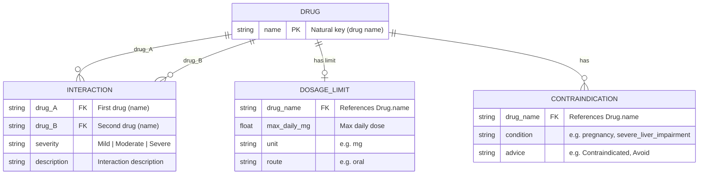

# MediSync – Entity Relationship Diagram (Project Structure)

This ER diagram reflects the **actual data model** used in the MediSync backend: JSON files and attributes as implemented.

## Data files → entities

| File | Entity / purpose |
|------|-------------------|
| `data/drug_interactions.json` | Drug–drug **Interaction** (keys: drug names; value: nested map → severity, description) |
| `data/drug_dosage_limits.json` | **DosageLimit** per drug (key: drug name; value: max_daily_mg, unit, route) |
| `data/drug_contraindications.json` | **Contraindication** per drug (key: drug name; value: condition → advice) |

**Drug** is the central entity: drug name is the identifier (natural key) used across all three files. There is no separate numeric `id` in the current implementation.

---

## ER diagram (Mermaid)

---

## Relationships (as implemented)

| Relationship | Cardinality | Description |
|--------------|-------------|-------------|
| **Drug ↔ Interaction** | Many-to-Many | One drug can have many interactions; each interaction involves exactly two drugs. Stored as symmetric map: both A→B and B→A. |
| **Drug → DosageLimit** | One-to-One (optional) | Each drug has at most one dosage limit (max_daily_mg, unit, route). |
| **Drug → Contraindication** | One-to-Many | Each drug can have multiple contraindications (condition + advice). |

---

## Backend usage

- **Interaction lookup:** `backend/interaction_checker.py` — O(1) via nested map; builds graph (nodes = drugs, edges = interactions).
- **Dosage checks:** `backend/dosage_contraindications.py` — compares `drug_doses` (from request) to `max_daily_mg` in `drug_dosage_limits.json`.
- **Contraindication checks:** `backend/dosage_contraindications.py` — matches `patient_context` (e.g. pregnancy, liver_impairment) to `drug_contraindications.json`.

---

**Regenerate PNG (optional)**  
- [Mermaid Live Editor](https://mermaid.live): paste the Mermaid block from above → export as PNG.  
- Or: `npx @mermaid-js/mermaid-cli -i docs/er_diagram.md -o docs/er_diagram.png -e png`
